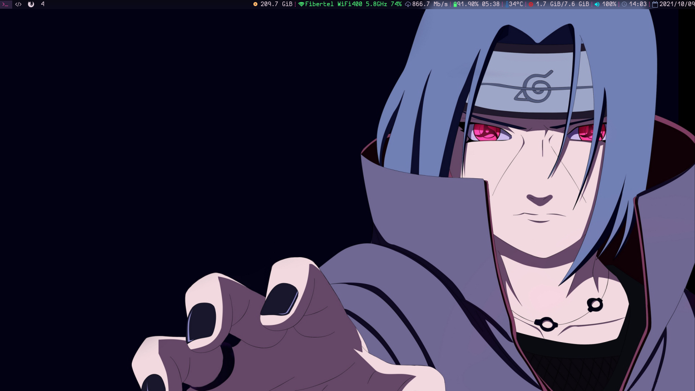
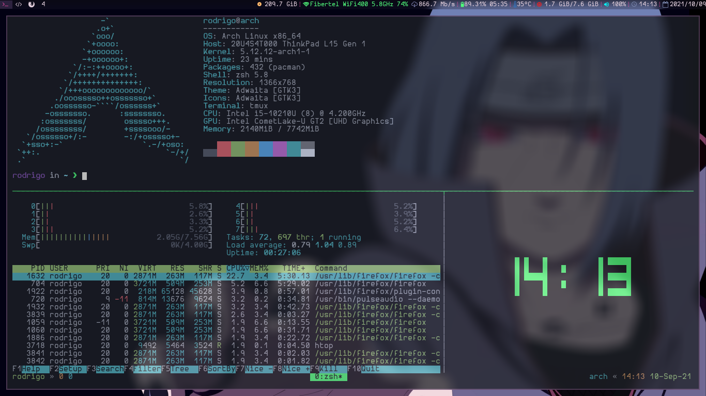

# dotfiles

- OS: [Arch Linux](https://archlinux.org/)
- WM: [i3](https://i3wm.org/)
- Shell: [zsh](https://www.zsh.org/)
- Terminal: [Alacritty](https://github.com/alacritty/alacritty)
- Launcher: [Rofi](https://github.com/davatorium/rofi)
- Compositor: [picom](https://github.com/yshui/picom)

## Clean desk

## Tmux

